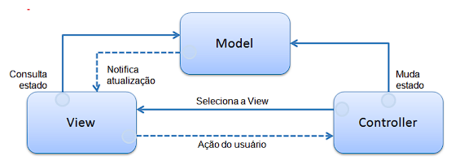

# Arquitetura MVC
- Model-View- Controller (Modelo-Visão-Controlador)
- Visa separar a lógica de negócio da apresentação;
- Permite desenvolvimento e teste dos componentes isoladamente.

**Componentes da MVC**

| Componente               | Descrição                                                                                                                                                            |
|--------------------------|----------------------------------------------------------------------------------------------------------------------------------------------------------------------|
| Model ou modelo de dados | Contém as funcionalidades da aplicação. Regras de negócio: tabelas, campos, estruturas, relacionamentos, etc. Também notifica a View quando os dados forem alterados |
| View ou interface        | Renderização do modelo de dados, interação com usuário, exibição de dados                                                                                            |
| Controller               | Responde às ações do usuário, possibilita mudanças no Model e seleciona a View correspondente                                                                        |

- Para facilitar o desenvolvimento no AdvlPl, o desenvolvedor trabalhará nas Views e Models. A parte responsável pelo Controller já está intrínseca.
- Foco na separação da Regra de Negócio e Interface.
