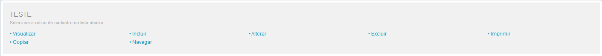

# Principais funções da aplicação em AdvPL utilizando o MVC
- Os desenvolvedores serão responsáveis por definir as seguintes funções:

| Função   | Descrição                                              |
|----------|--------------------------------------------------------|
| ModelDef | Construção e definição do Model (Regras de Negócio)    |
| ViewDef  | Construção e definição da View (Interface com usuário) |
| MenuDef  | Operações disponíveis para o Model                     |

- Cada fonte em MVC (PRW) só pode conter uma de cada dessas funções.

- Em uma aplicação AdvPl MVC, automaticamente devem estar disponíveis:
  - Pontos de Entradas já disponíveis;
  - Um Web Service para sua utilização;
  - Importação ou exportação mensagens XML.

- MVC não se baseia necessariamente em metadados (dicionários). Se baseia em estruturas baseadas em metadados ou construídas manualmente.

## O que é a função ModelDef?
- Define as regras de negócios, onde são definidas:
  - Todas as entidades (tabelas) que farão parte do Model;
  - Regras de dependência entre as entidades;
  - Validações (de campos e aplicação);
  - Persistência dos dados (gravação).
- Não precisa necessariamente haver uma interface;
- Pode ser utilizada em qualquer aplicação, pois está separada da interface;
- Deve ser uma **Static Function** dentro da aplicação.

## O que é a função ViewDef?
- Define a interface com o usuário;
- Como o usuário interage com o Modelo de Dados;
- Recebe os dados informados pelo usuário e fornece ao Modelo de Dados;
- Apresenta o trabalho.
- A interface pode ser baseada totalmente ou parcialmente em um metadado (dicionário), permitindo:

| Característica                                          | Justificativa                                                                                  |
|---------------------------------------------------------|------------------------------------------------------------------------------------------------|
| Reaproveitamento do código da interface                 | Uma interface básica pode ser acrescida de novos componentes                                   |
| Simplicidade no desenvolvimento de interfaces complexas | No MVC a construção de aplicações que tem GRIDs dependentes é extremamente fácil               |
| Agilidade no desenvolvimento                            | A criação e a manutenção se tornam muito mais ágeis                                            |
| Mais de uma interface por Bussiness Object              | Podem-se ter interfaces diferentes para cada variação de um segmento de mercado, como o varejo |

- A ViewDef deve ser uma **Static Function** dentro da aplicação

## O que é a função MenuDef?
- Define as operações quer serão realizadas pela aplicação;
- Inclusão, alteração, exclusão...
- Deve retornar um array em um formato específico com as seguintes informações:
  1. Título;
  2. Nome da aplicação associada;
  3.  Reservado;
  4.  Tipo de Transação a ser efetuada.
      1.  Pesquisar
      2.  Visualizar
      3.  Incluir
      4.  Alterar
      5.  Excluir
      6.  Imprimir
      7.  Copiar
  5.   Nível de acesso;
  6.   Habilita Menu Funcional.

```
Static Function MenuDef()
    Local aRotina := {}

    aAdd( aRotina, { 'Visualizar', 'VIEWDEF.COMP021_MVC', 0, 2, 0, NIL } )
    aAdd( aRotina, { 'Incluir' , 'VIEWDEF.COMP021_MVC', 0, 3, 0, NIL } )
    aAdd( aRotina, { 'Alterar' , 'VIEWDEF.COMP021_MVC', 0, 4, 0, NIL } )
    aAdd( aRotina, { 'Excluir' , 'VIEWDEF.COMP021_MVC', 0, 5, 0, NIL } )
    aAdd( aRotina, { 'Imprimir' , 'VIEWDEF.COMP021_MVC', 0, 8, 0, NIL } )
    aAdd( aRotina, { 'Copiar' , 'VIEWDEF.COMP021_MVC', 0, 9, 0, NIL } )

Return aRotina
```

- 2º parâmetro utiliza a chamada direta de uma aplicação, ela faz referência a uma ViewDef de um determinado fonte (PRW);
- A estrutura deste 2º parâmetro tem o formato:

```
ViewDef.<nome do fonte>
```

- Referencia-se a ViewDef de um fonte, pois ela é a função responsável pela a interface da aplicação;
- A MenuDef deve ser escrita da seguinte forma:

```
Static Function MenuDef()

    Local aRotina := {}

    ADD OPTION aRotina Title 'Visualizar' Action 'VIEWDEF.COMP021_MVC' OPERATION 2 ACCESS 0
    ADD OPTION aRotina Title 'Incluir' Action 'VIEWDEF.COMP021_MVC' OPERATION 3 ACCESS 0
    ADD OPTION aRotina Title 'Alterar' Action 'VIEWDEF.COMP021_MVC' OPERATION 4 ACCESS 0
    ADD OPTION aRotina Title 'Excluir' Action 'VIEWDEF.COMP021_MVC' OPERATION 5 ACCESS 0
    ADD OPTION aRotina Title 'Imprimir' Action 'VIEWDEF.COMP021_MVC' OPERATION 8 ACCESS 0
    ADD OPTION aRotina Title 'Copiar' Action 'VIEWDEF.COMP021_MVC' OPERATION 9 ACCESS 0

Return aRotina
```

- Resultado final o mesmo;
- É recomendado a 2ª forma, que utiliza comandos ao invés de posições de um vetor;
- Facilita manutenções;
-  MenuDef deve ser uma **Static Function** dentro da aplicação;
-  FWMVCMenu:
   -  obtêm-se um número padrão com as opções:
        1. Visualizar
        2. Incluir
        3. Alterar
        4. Excluir
        5. Imprimir
        6. Copiar

```
Static Function MenuDef()
Return FWMVCMenu( "COMP021_MVC" )
```

## Novo comportamento na interface
- Aplicações AdvPl tradicional:
  - Após a conclusão de uma operação de alteração fecha-se a interface e retorna ao Browse;
- Aplicações AdvPl MVC:
  - Após as operações de inclusão e alteração, a interface permanece ativa e no rodapé exibe-se a mensagem de que a operação foi bem sucedida.
