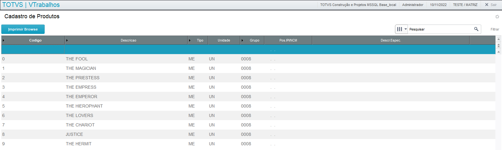
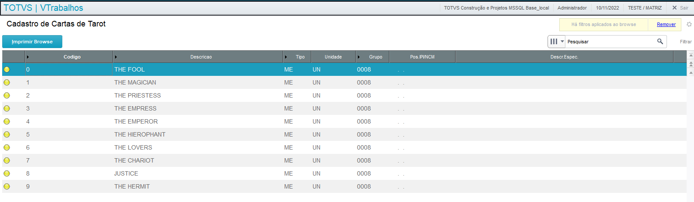

# Aplicações com Browses (FWMBrowse)
- Utiliza-se a classe FWMBrowse;
-  Exibe um objeto Browse que é construído a partir de metadados (dicionários).
- Não foi desenvolvida exclusivamente para o MVC;
- Características:
  - Substituir componentes de Browse;
  - Reduzir o tempo de manutenção, em caso de adição de um novo requisito;
  - Ser independente do ambiente Microsiga Protheus.
- Principais melhorias:
  - Padronização de legenda de cores;
  - Melhor usabilidade no tratamento de filtros;
  - Padrão de cores, fontes e legenda definidas pelo usuário – Deficiente visual;
  - Redução do número de operações no SGBD (no mínimo 3 vezes mais rápido);
  - Novo padrão visual.

## Construção de um Browse
### Construção básica de um Browse
- Exemplo: PM001.prw<br>


- Com esta estrutura, a aplicação já possui:
  - Pesquisa de registro;
  - Filtro configurável;
  - Configuração de colunas e aparência;
  - Impressão.

###  Legendas de um Browse (AddLegend)
- Adiciona legendas no Browse;
- Sintaxe:
  
```
AddLegend( <cRegra>, <cCor>, <cDescrição> )
```

```
oBrowse:AddLegend( "ZA0_TIPO=='1'", "YELLOW", "Autor" )

oBrowse:AddLegend( "ZA0_TIPO=='2'", "BLUE" , "Interprete" )
```

  - **cRegra** é a expressão em AdvPL para definir a legenda;
  - **cCor** é o parâmetro que define a cor de cada item da legenda.
    - GREEN para a cor Verde
    - RED para a cor Vermelha
    - YELLOW para a cor Amarela
    - ORANGE para a cor Laranja
    - BLUE para a cor Azul 
    - GRAY para a cor Cinza
    - BROWN para a cor Marrom
    - BLACK para a cor Preta
    - PINK para a cor Rosa
    - WHITE para a cor Branca
  - **cDescrição** é a que será exibida para cada item da legenda;
  - Observação:
    - Cada uma das legendas se tornará automaticamente uma opção de filtro;
    - Se houverem regras conflitantes será exibida a legenda correspondente à 1ª regra que for satisfeita.

### Filtros de um Browse (SetFilterDefault)
- Definir um filtro para o Browse;
- SetFilterDefault;
- Sintaxe:

```
SetFilterDefault ( <filtro> )
```

```
// EXEMPLOS
oBrowse:SetFilterDefault( "ZA0_TIPO=='1'" )

ou

oBrowse:SetFilterDefault( "Empty(ZA0_DTAFAL)" )
```

- O filtro definido na aplicação não anula a possibilidade do usuário fazer seus próprios filtros;
- Filtros feitos pelo usuário serão aplicados em conjunto com o definido na aplicação;

### Desabilitação de detalhes do Browse (DisableDetails)
- Para desabilitar a exibição automática dos dados da linha posicionada, utiliza-se o **DisableDetails**.

```
oBrowse:DisableDetails()
```

### Campos virtuais no Browse
- **Posicione**: Exibe campos virtuais no Browse;
- Base de dados SGBD: Browse acrescenta um INNER JOIN na query que será enviada ao SGBD, melhorando assim o desempenho para a extração dos dados.
-  Sempre utilizar a função Posicione para exibir campos virtuais.

### Exemplo completo de Browse
- Exemplo: PM002.prw


